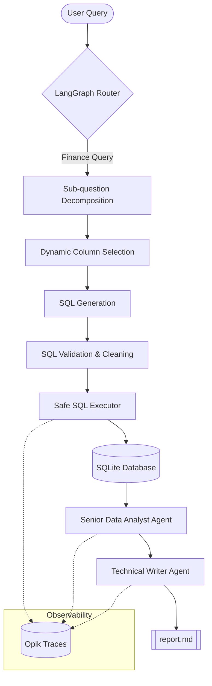

# 🤖 Autonomous SQL Analyst: Agentic Financial Intelligence

[](https://crewai.com)
[](https://comet.com/site/products/opik/)
[](https://deepmind.google/technologies/gemini/)

A sophisticated, multi-agent financial analytical engine that transforms natural language questions into professional, data-driven reports. This project combines the deterministic reliability of **LangGraph** for SQL generation with the creative reasoning power of **CrewAI** for executive reporting.

---

## 🏗️ System Architecture

The system operates as a hybrid agentic pipeline, separating "Data Retrieval" from "Data Interpretation."



---

## ✨ Key Features

### 1. Hybrid Agentic Design
- **LangGraph (Deterministic):** Handles the high-precision tasks of query routing, decomposition, and SQL execution. Ensures 0% hallucination by validating schema against a serialized Knowledge Base (`kb.pkl`).
- **CrewAI (Creative):** A crew of specialized agents (Senior Data Analyst & Technical Writer) interprets raw SQL results to provide context, identify patterns, and offer actionable advice.

### 2. High-Precision SQL Pipeline
- **Knowledge Base Integration:** Dynamically injects only the necessary table schemas into the context window to save tokens and improve accuracy.
- **Defensive Error Recovery:** Built-in "3-strike" rule with fallback logic for LLM index-swapping and hallucinated table names.
- **Fuzzy Matching:** Utilizes Levenshtein distance matching for filter values (e.g., matching "netflix" to "NETFLIX INC").

### 3. Production-Ready Infrastructure
- **Opik Observability:** Full distributed tracing of every agent interaction, tool call, and SQL execution.
- **Rate Limiting:** Intelligent pause-and-resume logic to respect free-tier API thresholds without crashing.
- **Safe SQL Execution:** Aggressive parsing and cleaning of SQL blocks to prevent conversational text from interfering with database execution.

---

## 🛠️ Tech Stack

- **Core Frameworks:** CrewAI, LangGraph, LangChain
- **LLM Engine:** Gemini 2.5 Flash (via LiteLLM)
- **Database:** SQLite
- **Observability:** Opik
- **Utilities:** Pandas, SQLAlchemy, FuzzyWuzzy, Pydantic (v2)

---

## 🚀 Getting Started

### Prerequisites
- Python 3.10+
- [uv](https://github.com/astral-sh/uv) (recommended) or pip

### Installation

1. **Clone the repository:**
   ```bash
   git clone <your-repo-url>
   cd sql_crew
   ```

2. **Install dependencies:**
   ```bash
   uv sync
   # OR
   pip install -r requirements.txt
   ```

3. **Configure Environment:**
   Create a `.env` file in the root directory:
   ```env
   GOOGLE_API_KEY=your_gemini_api_key
   OPIK_API_KEY=your_opik_api_key
   OPIK_WORKSPACE=your_workspace
   OPIK_PROJECT_NAME=sql_analyst
   ```

### Running the Application

1. **Generate the Knowledge Base (Optional):**
   ```bash
   python LangGRAPH_SQL/kb_generator.py
   ```

2. **Execute a Query:**
   Modify the query in `main.py` and run:
   ```bash
   python main.py
   ```

3. **View the Result:**
   Check `report.md` for the generated executive summary and analysis.

---

## 📊 Observability with Opik

This project uses **Opik** for real-time monitoring. Every run generates a trace that allows you to:
- Debug SQL generation failures.
- Inspect the reasoning steps of the CrewAI agents.
- Monitor token usage and latency per node.

To view your traces, log in to your [Opik Dashboard](https://www.comet.com/site/products/opik/).

---

## 📝 Project Structure

```text
├── CrewAI/                # CrewAI Agents & Task Definitions
├── LangGRAPH_SQL/         # LangGraph Nodes & Graph Logic
├── logs/                  # Automated timestamped logs
├── finance.db             # SQLite Database
├── kb.pkl                 # Serialized DB Schema Metadata
├── main.py                # System entry point
└── report.md              # Final generated output
```

---

## 🛡️ License
Distributed under the MIT License. See `LICENSE` for more information.
